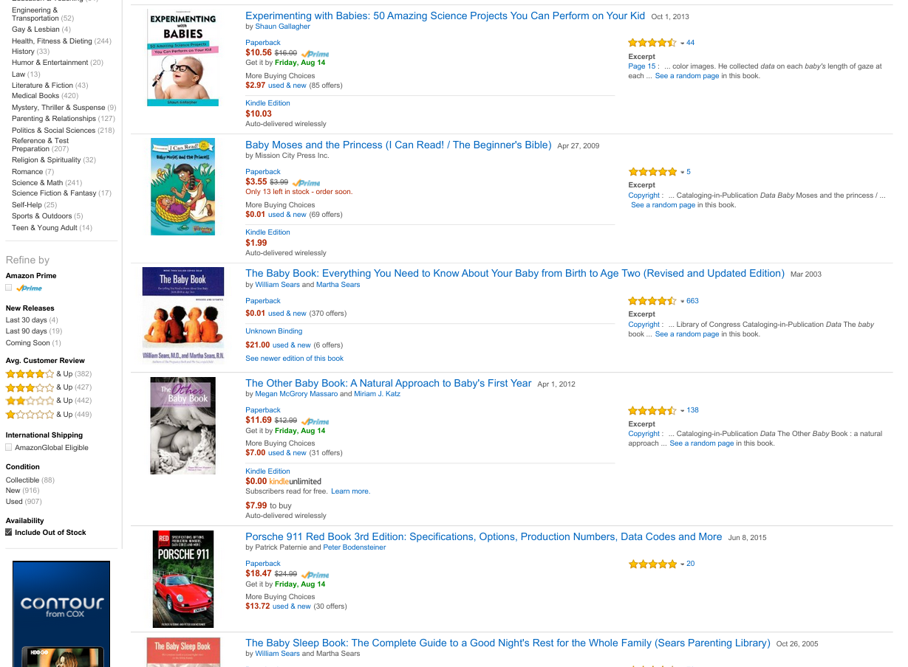

# Analogies

#### Freakonomics  
_Stephen J. Dubner, Steven D. Levitt_  
1994 customer reviews  

#### What to Expect When you're Expecting (4th Edition)  
_Heidi Murkoff, Sharon Mazel_  
1852 customer reviews  

#### Expecting Better  
_Emily Oster_  
422 customer reviews  

#### Dude, You're Gonna Be a Dad!  
_John Pfeiffer_  
365 customer reviews  

#### Let's Panic About Babies!  
_Alice Bradley, Eden M. Kennedy_  
104 customer reviews  

#### Do Chocolate Lovers Have Sweeter Babies?: The Surprising Science of Pregnancy  
_Jena Pincott_  
41 customer reviews  

## The data angle
An Amazon search for "baby data" yields lots of hits related to "baby", very little related to "data".
